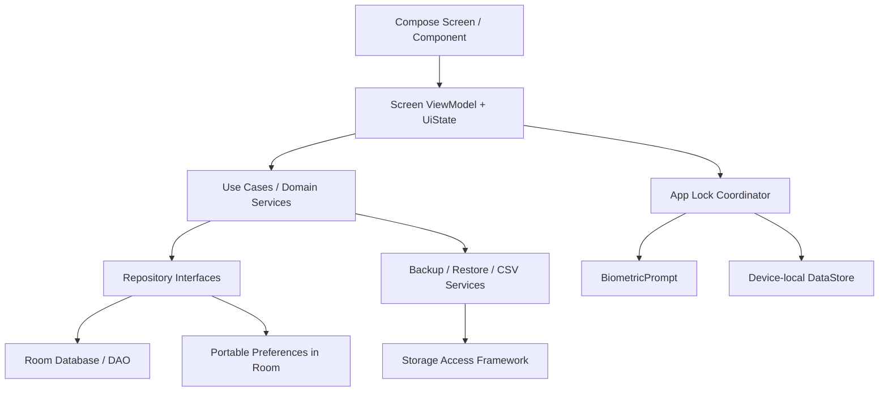

# 系统架构

> 版本：v1.0（已基线化）  
> 架构风格：单模块、分层、离线单一事实源、单向数据流

## 1. 总体结构



Room 是流水、账户、分类、预算及可迁移业务偏好的唯一事实源。UI 不直接访问 DAO、DataStore、`Context` 或文件 URI。

## 2. 包结构

```text
com.personalbookkeeping
├─ app/                 Application、MainActivity、AppContainer
├─ navigation/          NavKey、主导航与目的地注册
├─ ui/
│  ├─ home/
│  ├─ transaction/
│  ├─ ledger/
│  ├─ statistics/
│  ├─ settings/
│  ├─ components/
│  └─ theme/
├─ domain/
│  ├─ model/
│  ├─ repository/
│  ├─ usecase/
│  └─ validation/
├─ data/
│  ├─ repository/
│  ├─ mapper/
│  └─ paging/
├─ database/
│  ├─ entity/
│  ├─ dao/
│  ├─ relation/
│  ├─ migration/
│  └─ seed/
├─ backup/              DTO、校验、ZIP、恢复协调器
├─ export/              CSV 格式与 SAF 写入
├─ security/            应用锁、隐私遮罩、日志脱敏
└─ common/              Clock、IdGenerator、Money、Result
```

依赖方向只允许 UI → domain → repository contract；data/database/backup 实现由 `AppContainer` 注入。`database.entity` 不进入 UI，跨层使用明确 mapper。

## 3. UI 状态与事件

- 每个一级页面或完整编辑页面拥有 screen-level ViewModel。
- ViewModel 暴露一个不可变 `StateFlow<ScreenUiState>`；UI 使用生命周期感知收集。
- 用户操作调用明确方法，如 `saveExpense()`、`applyFilters()`，不使用无类型的全局事件总线。
- 一次性结果也进入可消费状态，例如 `SaveResult.Success(id)`；UI确认展示后调用 `resultShown()`，避免丢事件或重复弹出。
- 表单草稿通过 `SavedStateHandle` 保存原始字符串与选择 ID；金额只有校验通过后才转为 `Long` 分。

## 4. 核心用例

| 用例 | 责任 |
|---|---|
| `CreateTransactionUseCase` | 校验收支/转账形状并原子写入 |
| `UpdateTransactionUseCase` | 以事务替换旧记录影响 |
| `DeleteTransactionUseCase` | 删除并返回可短时恢复的领域快照 |
| `ObserveDashboardUseCase` | 组合月汇总、预算和最近流水 |
| `ObserveStatisticsUseCase` | 分类排行、趋势和下钻条件 |
| `ManageAccountUseCase` | 名称规则、停用及默认账户切换 |
| `ManageCategoryUseCase` | 分类唯一性、排序和停用 |
| `CreateBackupUseCase` | 一致性快照、序列化、校验与 SAF 输出 |
| `RestoreBackupUseCase` | 不可信输入校验、回滚快照和事务替换 |
| `ExportCsvUseCase` | 过滤、RFC 4180 转义和 SAF 输出 |

金额、周期、账户余额、预算消耗、备份校验由纯 Kotlin 领域代码封装，便于本地单元测试。

## 5. 写入与并发模型

- 普通数据库写入使用 Room `withTransaction`；SQLite 事务是原子性的最终保障。
- `DataMutationCoordinator` 使用应用级 `Mutex` 串行化“恢复”和普通写操作，避免恢复期间出现新流水。
- 备份在短事务内读取一致性快照，事务结束后再序列化和写文件，避免长时间锁库。
- 文件任务通过结构化协程执行；ViewModel 销毁不应导致已进入安全提交阶段的恢复留下半状态。
- 不使用全局 `GlobalScope`；所有 dispatcher 由构造注入，测试可替换。

## 6. 导航

使用 Navigation 3 的类型安全 key：

- 一级：`HomeKey`、`LedgerKey(filters?)`、`StatisticsKey(period)`、`SettingsKey`。
- 编辑：`TransactionEditorKey(transactionId?)`。
- 管理：`AccountsKey`、`CategoriesKey(kind)`、`BudgetKey(period)`。
- 数据：`BackupRestoreKey`、`RestoreReviewKey(stagedToken)`、`CsvExportKey`。

导航参数只传 ID、期间或轻量筛选；完整业务对象从 repository 读取。恢复文件 URI 不写进路由文本，使用进程内 staged token 或 `SavedStateHandle`。

## 7. 依赖注入

`PersonalBookkeepingApplication` 创建单例 `AppContainer`，持有数据库、repository、clock、dispatcher、backup/export service 和 lock coordinator。ViewModel factory 显式获取依赖。

选择手工注入的原因：对象图小、无动态 feature、可减少 KSP/Gradle 复杂度。测试通过 `FakeRepository`、`FakeClock`、`FakeIdGenerator` 和临时文件服务替换，不使用 service locator 隐式查找。

## 8. 错误模型

底层异常必须转换为有限领域错误：`ValidationError`、`StorageUnavailable`、`BackupCorrupt`、`BackupUnsupported`、`DatabaseFailure`、`AuthenticationUnavailable`。UI 不展示堆栈、SQLite 错误文本或真实路径。

可重试读取错误保留最后可用内容并提供重试；写入失败保留表单；恢复失败明确“当前账本未改变”或“已从回滚快照恢复”。
