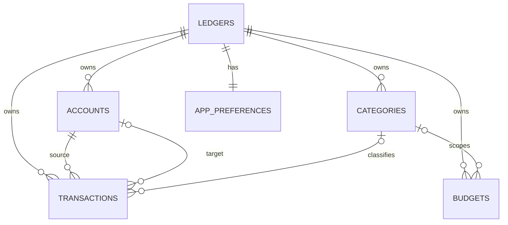

# 数据库设计

> 版本：v1.0（已基线化）  
> 数据库：Room 2.8.4 / SQLite  
> 初始 schema version：1

## 1. 设计原则

- 流水是金额变化的事实源，账户余额、月汇总、分类统计和预算消耗均通过查询派生。
- 金额统一使用 64 位整数“分”，禁止数据库和领域层使用浮点金额。
- 所有写入使用数据库事务；转账只保存一行，通过来源/目标账户同时派生影响。
- 历史引用存在时账户/分类只能停用，外键使用 `RESTRICT` 防止误删。
- 不存储用户输入生成的 SQL；筛选条件通过 Room 参数绑定。

## 2. 实体关系

## 3. 表定义

### `ledgers`

MVP 只创建一行，但保留 `ledger_id` 外键以避免未来多账本迁移重写所有表。

| 字段 | 类型 | 规则 |
|---|---|---|
| `id` | TEXT PK | UUID 字符串 |
| `name` | TEXT | 去除首尾空格后非空，≤ 40 字符 |
| `currency_code` | TEXT | v1 固定 `CNY` |
| `month_start_day` | INTEGER | v1 固定 1 |
| `created_at_ms` / `updated_at_ms` | INTEGER | UTC epoch millis |

### `accounts`

| 字段 | 类型 | 规则 |
|---|---|---|
| `id`, `ledger_id` | TEXT | 主键与账本外键 |
| `name` | TEXT | 原始显示名，≤ 40 字符 |
| `active_name_key` | TEXT? | 活动时为 Unicode 规范化 + 去空白 + 小写后的名称；停用时为 null |
| `type` | TEXT | `CASH/BANK/E_WALLET/STORED_VALUE/CREDIT_CARD/OTHER` |
| `opening_balance_minor` | INTEGER | 可为负，单位分 |
| `include_in_assets` | INTEGER | 0/1；信用卡可计入净资产并形成负余额 |
| `status` | TEXT | `ACTIVE/INACTIVE` |
| `sort_order` | INTEGER | 非负 |
| 时间字段 | INTEGER | created/updated UTC millis |

唯一索引 `(ledger_id, active_name_key)`：SQLite 允许多个 null，因此历史停用名称可重复，而活动名称不可重复。

### `categories`

与账户使用相同的活动名称键策略。`kind` 为 `EXPENSE` 或 `INCOME`；另含稳定的 `icon_key`、`color_key` 和排序值，避免把平台资源 ID 写入数据库。

### `transactions`

| 字段 | 类型 | 规则 |
|---|---|---|
| `id`, `ledger_id` | TEXT | 主键与账本外键 |
| `type` | TEXT | `EXPENSE/INCOME/TRANSFER` |
| `amount_minor` | INTEGER | 必须 > 0 |
| `category_id` | TEXT? | 收支必填，转账为空 |
| `account_id` | TEXT | 支出来源、收入入账或转出账户 |
| `target_account_id` | TEXT? | 仅转账必填，且不同于 `account_id` |
| `occurred_at_ms` | INTEGER | 用户选择时间对应的 UTC epoch millis |
| `zone_id` | TEXT | 记录时使用的 IANA zone，例如 `Asia/Shanghai` |
| `local_date_epoch_day` | INTEGER | 对应本地民用日期，用于稳定的自然月查询 |
| `note` | TEXT? | ≤ 500 字符；空白规范化为 null |
| 时间字段 | INTEGER | created/updated UTC millis |

报表按 `local_date_epoch_day` 计算，因此旅行、系统时区变化不会把历史流水移动到另一天。编辑发生时间时同时重算 epoch、zone 和 local date。

### `budgets`

`period_key` 使用 `YYYY-MM`；`scope_key` 为 `TOTAL` 或 `CATEGORY:<categoryId>`。唯一索引 `(ledger_id, period_key, scope_key)` 解决 SQLite 对 null 的唯一性语义。分类预算带 `category_id`，总预算为空。

### `app_preferences`

每账本一行，保存需要随完整备份迁移的业务/显示偏好：主题、金额遮罩、最近支出/收入账户。应用锁启用状态、认证时间和首次引导属于设备状态，保存到 DataStore 且不进入备份。

## 4. 交易形状约束

| 类型 | category | account | target account | 统计影响 |
|---|---|---|---|---|
| EXPENSE | 支出分类，必填 | 必填 | null | 支出 +amount；账户 -amount；预算 +amount |
| INCOME | 收入分类，必填 | 必填 | null | 收入 +amount；账户 +amount |
| TRANSFER | null | 必填 | 必填且不同 | 来源 -amount；目标 +amount；收支/预算不变 |

领域层先校验，SQLite `BEFORE INSERT/UPDATE` 触发器再次拒绝非法形状。触发器由数据库创建回调及每次相关迁移显式建立，并纳入设备测试。

## 5. 索引

- `transactions(ledger_id, local_date_epoch_day DESC, occurred_at_ms DESC)`：流水与月份查询。
- `transactions(account_id, local_date_epoch_day DESC)`：账户筛选和余额。
- `transactions(target_account_id, local_date_epoch_day DESC)`：转入影响。
- `transactions(category_id, local_date_epoch_day DESC)`：分类统计与下钻。
- `accounts(ledger_id, active_name_key)`、`categories(ledger_id, kind, active_name_key)`：活动名称唯一。
- `budgets(ledger_id, period_key, scope_key)`：预算唯一与期间读取。
- `budgets(category_id)`、`app_preferences(recent_*_account_id)`：覆盖外键索引，避免分类/账户更新时全表扫描。

备注搜索 MVP 使用 `LIKE '%' || :query || '%'`。1 万笔目标规模下先测量；只有真实性能不达标时再引入 FTS5，避免双写和迁移成本。

## 6. 派生查询

- 账户余额通过期初余额与流水 delta 聚合；不保存 `current_balance`。
- 月收入/支出按 type 和本地日期范围 `SUM`。
- 分类排行按 category 分组，排除转账。
- 每日趋势按 `local_date_epoch_day` 分组。
- 预算消耗只聚合支出；总预算与分类预算分别计算。

DAO 查询返回专用 projection，不加载完整 Entity 后在 UI 聚合。

## 7. 删除与撤销

MVP 使用真实删除，不增加软删除字段。删除事务完成后，ViewModel 在短时间内持有领域快照；用户点击撤销时以原 ID 重新插入。应用被终止后撤销窗口结束。该策略避免所有查询长期携带 `deleted=false` 条件。

## 8. 初始化与迁移

- 首次创建在一个事务中插入账本、现金账户、默认分类和 `app_preferences`。
- `exportSchema=true`，schema JSON 提交版本控制。
- 简单增列可用 AutoMigration；重命名、拆表、约束变化使用显式 Migration。
- 禁止 `fallbackToDestructiveMigration()`；任何生产 schema 变更必须有 `MigrationTestHelper` 测试和旧版 fixture。
- [数据库参考 DDL](database-schema-v1.sql) 用于评审和测试预期；实现后以 Room 导出的 schema 为最终机器事实，并对两者做差异复核。
