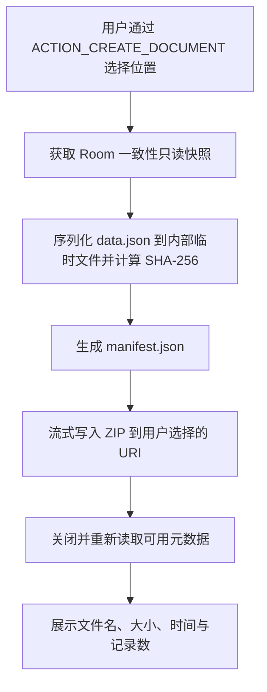

# 备份与导出设计

> 版本：v1.0（已基线化）  
> 完整备份扩展名：`.pbk`  
> 格式版本：1

## 1. 目标与非目标

完整备份用于无损恢复，CSV 用于阅读和表格分析。两者不互相替代。

`.pbk` v1 是可移植的逻辑数据备份，不直接复制 Room/SQLite 文件。这样数据库 schema 可演进，恢复逻辑仍能通过明确的格式迁移读取旧备份。

MVP 备份不加密。创建前必须明确提示“备份包含个人财务数据，请保存到可信位置”。不使用仅绑定当前设备的 Keystore 加密，因为这会使换机恢复失效；口令加密需要新增密码创建/恢复 UX，列为 P1 正式变更候选。

## 2. 容器结构

`.pbk` 是 ZIP/Deflate 容器，固定只允许以下条目：

```text
personal-bookkeeping-2026-07-21T143000Z.pbk
├─ manifest.json
└─ data.json
```

- `manifest.json`：格式、应用版本、创建时间、记录数、数据文件大小与 SHA-256。
- `data.json`：账本、账户、分类、流水、预算和可迁移偏好。
- JSON 为 UTF-8、无 BOM；字段名和 enum 使用稳定英文，不随界面语言改变。
- ZIP 条目路径必须完全匹配，禁止目录、绝对路径、`..`、重复条目和符号链接语义。

机器契约：

- [manifest JSON Schema](schemas/backup-manifest-v1.schema.json)
- [data JSON Schema](schemas/backup-data-v1.schema.json)

## 3. 版本策略

- `formatVersion` 独立于 `databaseSchemaVersion`。
- 仅增加可忽略字段时仍需评估兼容；v1 采用严格字段集合，任何结构变化默认提升格式版本。
- 读取器支持当前格式和所有承诺兼容的旧格式，通过 `BackupMigrator` 转为当前 DTO。
- 若版本高于当前读取器支持范围，在修改数据库之前拒绝，并显示“备份来自较新版本”。
- 每个发布版本保留至少一份脱敏黄金备份 fixture，用于未来恢复回归。

## 4. 创建备份



- 数据快照读取在短 Room 事务中完成；文件压缩在事务外执行。
- 内部临时文件位于 cache/no-backup 区域，成功或失败均清理。
- 用户取消系统选择器返回 `Cancelled`，不显示错误。
- 输出失败不能影响业务数据库。

## 5. 恢复与全量替换

恢复把所选 URI 视为不可信输入：

1. 使用 `ACTION_OPEN_DOCUMENT` 选择 `.pbk`。
2. 检查容器大小（最大 100 MiB）、条目数（恰好 2）、单条目和总解压上限（100 MiB）。
3. 先读取 manifest，验证 schema、格式版本、条目路径和声明大小。
4. 流式解压 data 并计算 SHA-256；摘要不一致立即拒绝。
5. 校验 data JSON Schema，再做语义校验：ID 唯一、引用存在、单账本/CNY/自然月、金额范围、交易形状、预算作用域、记录数一致。
6. 展示备份时间、应用版本和各实体数量，用户确认全量替换。
7. 在 `noBackupFilesDir` 创建当前数据的 `pre-restore.pbk` 回滚快照。
8. 获取 `DataMutationCoordinator` 写锁，在单个 Room 事务中按外键顺序清空、批量插入并运行余额/统计一致性检查。
9. 检查失败抛出异常，SQLite 自动回滚；异常退出时启动恢复日志指导下次启动清理或回滚。
10. 成功后保留最近一个 pre-restore 快照，下一次成功恢复时替换；不向用户文件区静默写入。

恢复期间界面不可再次触发恢复或记账。应用切后台可继续到安全停止点，但不依赖长期后台服务。

## 6. 资源与拒绝服务限制

- 最大压缩文件、总解压数据均为 100 MiB。
- 最大流水 1,000,000；账户 10,000；分类 10,000；预算 100,000。
- 字符串限制与数据库规则一致；备注最多 500 字符。
- JSON 解析优先流式或受限缓冲，不把未验证的任意大字符串直接载入内存。
- 不信任 ZIP 中的 CRC 作为安全完整性校验，使用 manifest 中的 SHA-256。

## 7. 数据是否进入备份

| 数据 | 完整备份 | 原因 |
|---|---|---|
| 账本、账户、分类、流水、预算 | 是 | 核心业务数据 |
| 主题、金额遮罩、最近账户 | 是 | 可迁移非敏感偏好 |
| 应用锁启用状态、认证时间 | 否 | 设备安全状态，恢复后不应意外锁定用户 |
| 引导完成状态、临时筛选、滚动位置 | 否 | 设备/会话状态 |
| 日志、缓存、回滚临时文件 | 否 | 非用户数据或内部恢复数据 |

## 8. CSV v1

- 使用 Storage Access Framework 创建文件，不申请存储权限。
- UTF-8 with BOM：提高常见中文版 Excel 直接打开时的编码识别；契约测试同时验证 BOM。
- 换行使用 CRLF；字段按 RFC 4180 风格转义。
- 固定列：`type,amount,currency,category,account,target_account,occurred_at,note,created_at,updated_at`。
- `amount` 为正的两位十进制，方向由 `type` 表达；时间为 ISO 8601 含偏移。
- 用户选定日期范围；行顺序按发生时间升序，便于外部分析和稳定测试。
- 导出不包含内部 ID、活动名称键、应用锁状态或已删除记录。

## 9. Android 文件接口

创建使用 `ACTION_CREATE_DOCUMENT`，恢复使用 `ACTION_OPEN_DOCUMENT`。Storage Access Framework 由用户选择文件和文档提供者，正常情况下不需要存储权限；云盘是否可用由用户安装的文档提供者决定，应用不主动联网。

参考：[Android Storage Access Framework 官方说明](https://developer.android.com/training/data-storage/shared/documents-files)。
