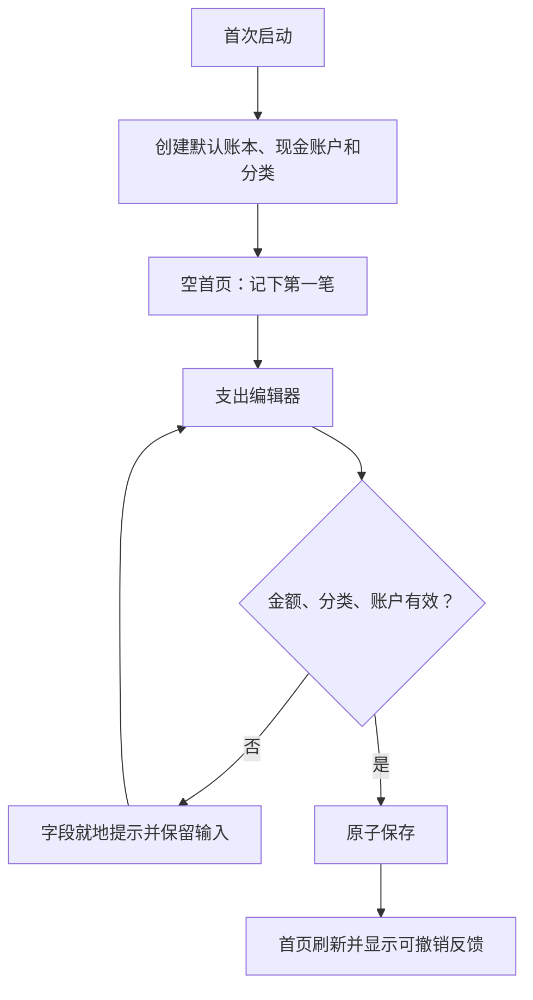
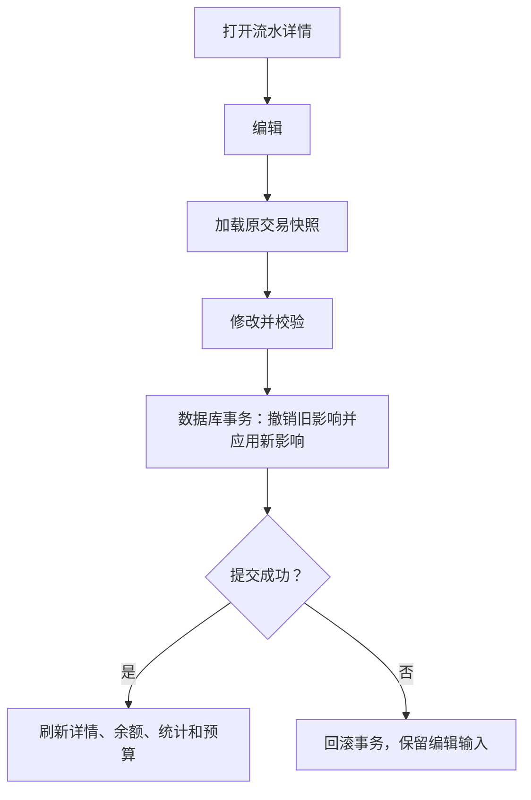
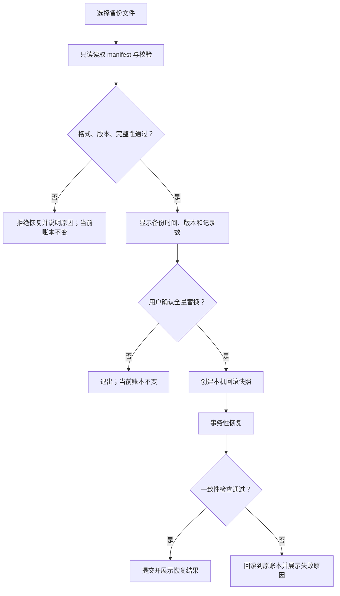

# 核心交互流程

## 1. 首次使用到第一笔支出

## 2. 编辑交易的一致性流程

## 3. 统计分类下钻

`统计选择月份 → 点击分类排行 → 打开流水页 → 固定月份 + 支出类型 + 分类条件 → 查看/编辑某笔 → 返回仍保留筛选 → 返回统计仍保留月份`

## 4. 预算设置

`首页预算入口/设置 → 输入月总预算 → 可选设置分类预算 → 即时预览已有支出占用 → 保存 → 首页和统计刷新`

分类预算之和允许大于总预算，因为两者分别用于提示，不做强制资金分配；界面需说明该规则。

## 5. 完整恢复

## 6. 应用锁

`冷启动或后台超过设定时长 → 内容先遮罩 → 调起系统认证 → 成功后展示原页面；失败/取消继续遮罩；系统不支持时不可开启并解释原因。`

